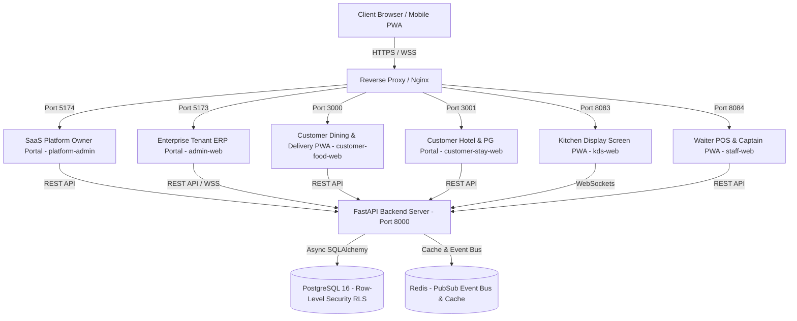

# Enterprise Master Architecture Baseline (ARCHITECTURE.md)

> **Last Reviewed**: August 2026

This document represents the single canonical enterprise architectural blueprint for **The ssrone** (SSR INFINITY).

---

## 1. System Architecture Blueprint



---

## 2. 5-Level Enterprise Hierarchy & Context Law ([ADR-0006](file:///e:/2026/ssr_one_ai/.agents/02-architecture/DECISIONS/ADR-0006-universal-multi-tenant-context-architecture.md))

The platform enforces a strict 5-level hierarchy:

```
Platform (SaaS Superadmin)
 └── Tenant (Commercial Boundary — ₹12,000/yr Subscription, Entitlements)
      └── Company (Legal & Tax Boundary — GSTIN, CIN, Accounting)
           └── Branch (Operational Boundary — Outlets, POS, KDS, Stock, Rooms)
                └── User / Role / Permission (RBAC Context & Allowed Branches)
```

### Context Request Headers
All API calls carry:
- `X-Tenant-ID`: Tenant ID
- `X-Company-ID`: Company ID
- `X-Branch-ID`: Branch ID
- `X-Fin-Year`: Financial Year Code (`FY-2026-27`)

---

## 3. Single Codebase, Metadata-Driven Customer Portals (`apps/`)

- **Rule**: NEVER create separate codebases per customer (e.g. no `customer-food-web-abc`).
- The apps `customer-food-web`, `customer-stay-web`, `admin-web`, `pos-kiosk`, `kds-web`, `staff-web` are **single codebases**.
- On mount, apps call `GET /api/v1/public/tenant-context` and render dynamically based on Tenant + Company + Branch configuration metadata (logos, colors, menus, room types, delivery options).

---

## 4. Monorepo Structural Blueprint

```
ssr_one_ai/
├── apps/                        # Frontend Web Apps (platform-admin, admin-web, customer-food-web, customer-stay-web, staff-web, kds-web)
├── services/backend/            # Python FastAPI Core Backend Service & 38 CRUD Entities
├── packages/                    # Shared Workspace npm Packages (@ssrone/*)
├── plugins/                     # Optional Industry Add-on Extensions (spa, banquet, laundry, parking, franchise)
├── database/                    # Raw PostgreSQL Schemas & Migration DDL
└── docs/                        # Project Documentation
```

---

## 5. Single Source of Truth (SSOT) Law

- **PostgreSQL Database** is the ONLY source of truth.
- Mock objects, hardcoded fallback arrays, and demo JSON records are strictly forbidden in production code.
