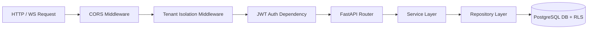

# Backend Architecture Specification

> **Last Reviewed**: August 2026

This document defines the backend microservice architecture for **The ssrone** Python FastAPI server (`services/backend`).

---

## 1. Module Layering (Service-Repository Pattern)

Every module inside `services/backend/src/modules/` MUST strictly maintain 5 files:

```
services/backend/src/modules/<module_name>/
├── __init__.py
├── models.py            # SQLAlchemy 2.0 ORM DB Models
├── schemas.py           # Pydantic v2 Request/Response Schemas
├── repository.py        # Database Access Layer (AsyncSession queries)
├── services.py          # Domain Logic & Business Rules Layer
└── router.py            # FastAPI APIRouter Endpoint Controllers
```

---

## 2. Request Lifecycle & Middleware Stack



---

## 3. Database Session Injection

Database sessions MUST be injected into routes using FastAPI dependency injection (`Depends(get_db_session)`). Handlers must never instantiate unmanaged DB sessions manually.
