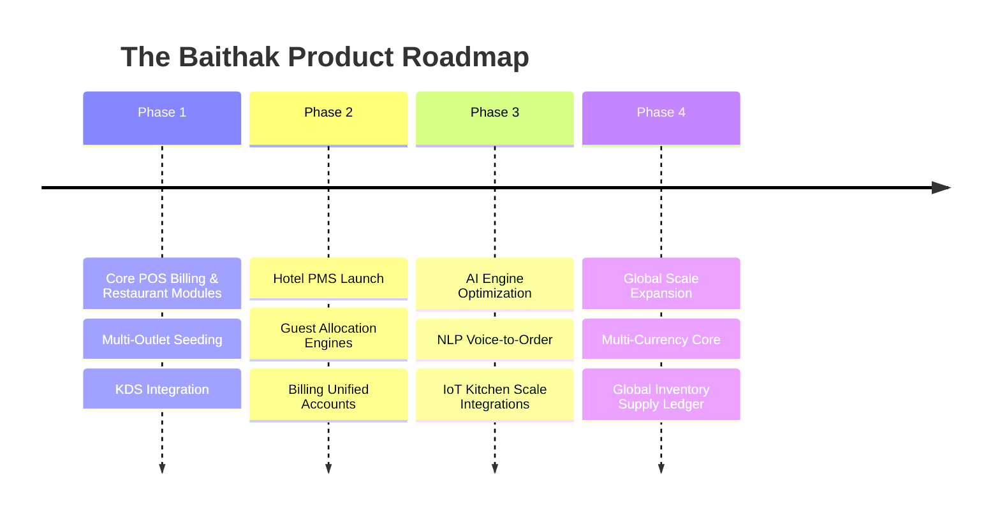

# The Baithak — Vision Document
**Version:** 1.0  
**Status:** Frozen  
**Target Valuation & Product Tier:** ₹1000 Cr Enterprise Hospitality Suite  

---

## 1. Executive Summary & Product Objective
**The Baithak** is an AI-native, metadata-driven unified hospitality operating system. Unlike legacy ERPs, which isolate POS, Property Management (PMS), CRM, and Finance into discrete, rigid databases, The Baithak consolidates all hospitality operational business models (restaurants, multi-outlet franchises, cloud kitchens, hotels, and student housing/PGs) into a singular schema.

Our mission is to build the world's most performant and customizable hospitality platform by leveraging **reusable database-driven metadata engines** over customized, static hardcoded components.

---

## 2. Market Opportunity & Target Segments
The global hospitality software industry is fragmented between legacy visual POS systems (which struggle to manage complex franchise flows) and specialized PMS tools (which lack restaurant-grade POS functionality). The Baithak addresses the following segments:

1. **Multi-Outlet & Franchise QSRs**: High-footprint chains needing centralized inventory, real-time recipe management, KDS dispatching, and unified sales reconciliation.
2. **Cloud Kitchen Networks**: Multi-brand virtual operations needing aggregate channel injection, smart order routing, and rapid recipe assembly.
3. **Hybrid Hotel & Property Management**: Resorts and boutique hotels requiring integrated front-office room booking, billing, dining POS, and guest history tracking.
4. **Sweet Shops & Bakeries**: Retail-wholesale operations requiring shelf-life tracking, dynamic inventory, and weight-scale POS integrations.

---

## 3. Competitor Analysis & Differentiators

| Feature | Legacy POS / PMS (Toast, Opera) | The Baithak Ecosystem |
| :--- | :--- | :--- |
| **Architecture** | Heavy client-side state / Siloed relational tables | Metadata-Driven / Single Database Schema |
| **Speed / POS Layout** | Slow menu browsing, high cashier search latency | Smart Command Center POS / <1s Acronym Search |
| **AI Capabilities** | Optional add-on, simple analytics | Core AI Quick Command parser / Dynamic Combo Upsells |
| **Multi-Tenancy** | Individual databases, hard to aggregate | Native Row-Level Security / Multi-Tenant, Multi-Branch |

---

## 4. Revenue Model
- **SaaS Subscription Tier**: Charged per physical register/outlet per month.
- **Franchise Royalty Engine**: Integrated revenue-share tracking on billing nodes.
- **AI Upsell commission**: Marginal monetization on customer engagement points.

---

## 5. Long-Term Product Roadmap

