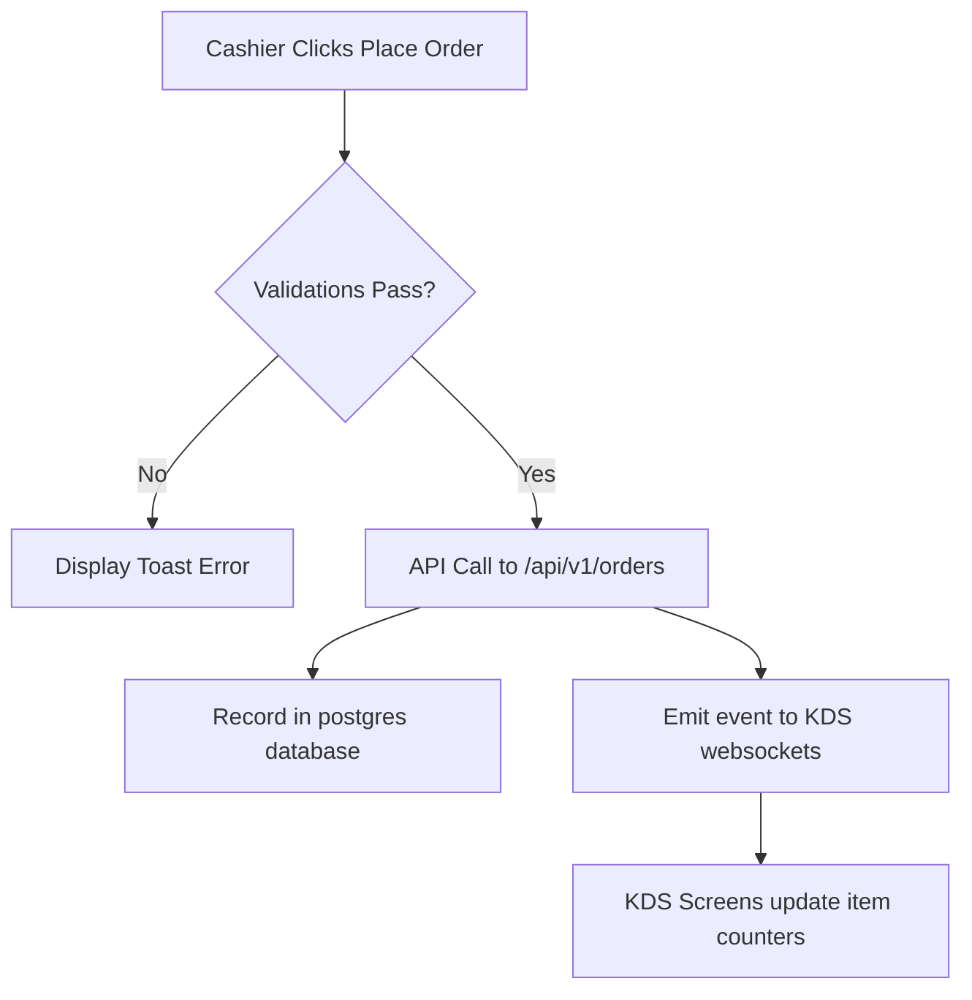

# The Baithak — Functional Requirement Specification (FRS)
**Version:** 1.0  
**Status:** Frozen  

---

## 1. POS Billing & AI Order Flow

### 1.1 Actor Action: AI Command Input
- **Inputs**: Alphanumeric text string entered in the AI Command Box.
- **Validations**:
  - Empty commands must be ignored.
  - Multi-item tokens separated by "and", ",", or "+" must be parsed individually.
  - Sizing keywords (e.g. `small`, `medium`, `large`, `half`, `full`) must match available options in the product's `variant_groups`. If none matches, default to the first option.
  - Modifiers (e.g. `cheese burst`, `extra ice cream`) must match available options in the `addon_groups`.
- **System Action**:
  - Searches for exact acronym match (e.g. `pb` -> `Paneer Burger`).
  - If no acronym match, calculates token overlap scores across the catalog.
  - Resolves base pricing + addon markups.
  - Pushes items to the cart or increments quantities.

---

## 2. Customer Loyalty Intelligence

### 2.1 Actor Action: Mobile Phone Lookup
- **Input**: Alphanumeric phone query string.
- **Validations**:
  - Search runs on string prefix. Length must be $\ge 4$ characters to prevent heavy database scans.
- **Outputs**:
  - Displays customer name, gold/silver/platinum tier, lifetime spent, and loyalty points balance.
  - Renders a "Repeat Last Order" button if the customer has a stored previous order preference.

---

## 3. Order Checkout & KDS Dispatch

### 3.1 Tax Calculations
- **GST Rate**: Hardcoded default of 5% for Food & Beverage services (unless otherwise specified in metadata).
- **Formula**:
  $$\text{Subtotal} = \sum (\text{Price} \times \text{Quantity})$$
  $$\text{GST Tax} = \text{Subtotal} \times 0.05$$
  $$\text{Grand Total} = \text{Subtotal} + \text{GST Tax}$$

---

## 4. Edge Cases & Exception Handling
- **Duplicate Addon Selection**: If the user inputs the same addon multiple times (e.g. "cheese burst with cheese burst"), the system must only apply it once.
- **Offline Mode Transition**: If API returns 401/500 during checkout, the system must write the order to local IndexedDB/LocalStorage, notify the user, and clear the cart state.
